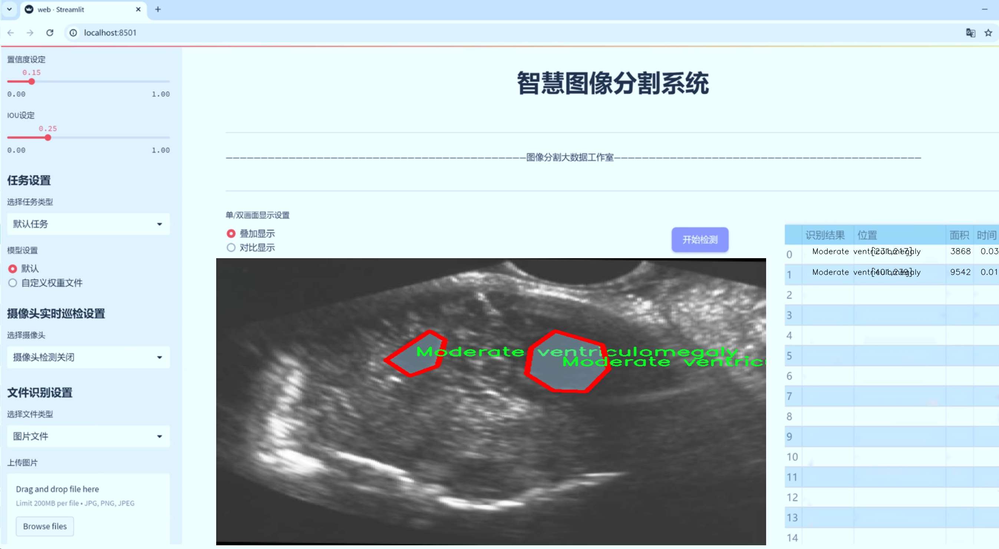
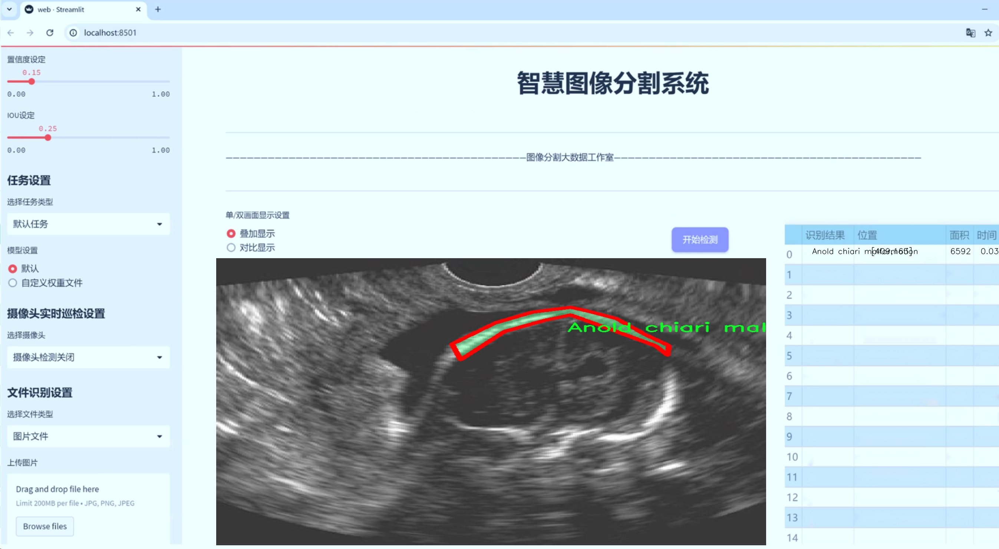
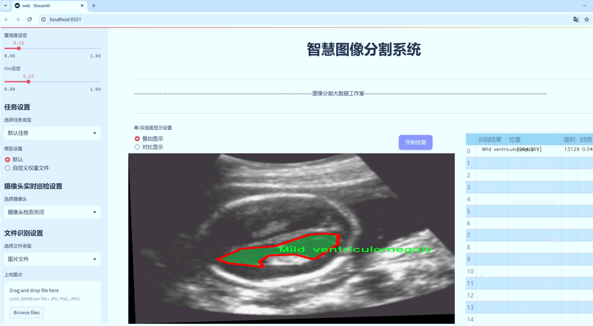
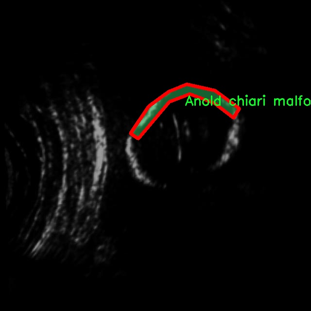
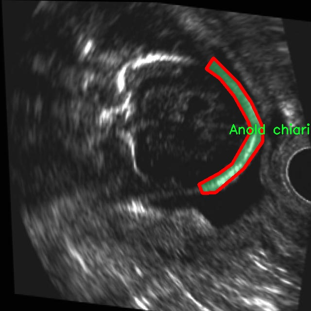
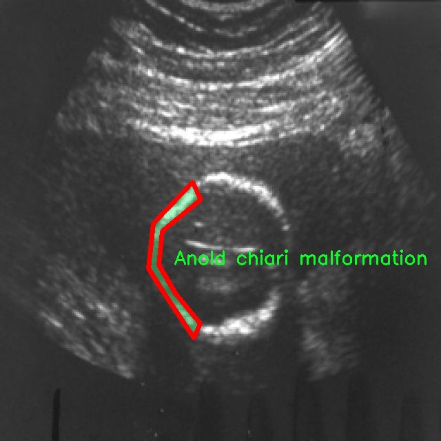
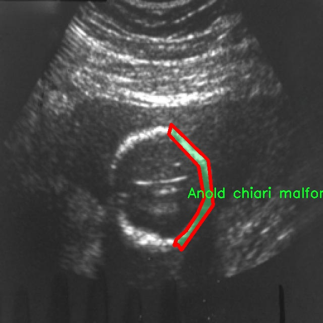
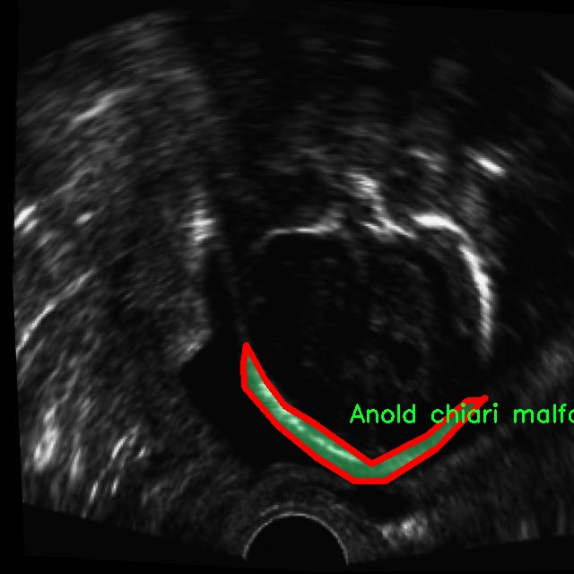

# 胎儿脑部异常识别图像分割系统源码＆数据集分享
 [yolov8-seg-SPDConv＆yolov8-seg-LAWDS等50+全套改进创新点发刊_一键训练教程_Web前端展示]

### 1.研究背景与意义

项目参考[ILSVRC ImageNet Large Scale Visual Recognition Challenge](https://gitee.com/YOLOv8_YOLOv11_Segmentation_Studio/projects)

项目来源[AAAI Global Al lnnovation Contest](https://kdocs.cn/l/cszuIiCKVNis)

研究背景与意义

随着医学影像技术的迅速发展，胎儿脑部异常的早期诊断变得愈发重要。胎儿期是神经系统发育的关键阶段，任何异常都可能对胎儿的生长发育产生深远的影响。根据统计数据，胎儿脑部异常的发生率逐年上升，这使得相关的医学研究和临床应用显得尤为迫切。传统的胎儿脑部异常检测方法多依赖于医生的经验和主观判断，容易受到人为因素的影响，导致诊断结果的准确性和一致性不足。因此，开发一种高效、准确的自动化图像分割系统，以辅助医生进行胎儿脑部异常的识别和诊断，具有重要的临床意义。

本研究基于改进的YOLOv8模型，旨在构建一个针对胎儿脑部异常的图像分割系统。YOLO（You Only Look Once）系列模型以其快速的检测速度和较高的准确性在计算机视觉领域广泛应用。YOLOv8作为最新版本，结合了多种先进的深度学习技术，具备更强的特征提取能力和更高的处理效率，能够有效应对复杂的医学影像数据。通过对YOLOv8模型的改进，特别是在图像分割任务中的应用，我们期望能够提高胎儿脑部异常的检测率和分割精度。

本研究所使用的数据集包含1400幅图像，涵盖14种不同类型的胎儿脑部异常，包括小脑发育不全、脑积水、脑膜囊肿等。这些异常的多样性为模型的训练提供了丰富的样本，有助于提升模型的泛化能力。每种异常的特征和表现形式各不相同，要求模型能够在多种情况下保持良好的识别效果。通过对这些数据的深入分析和处理，我们可以提取出有效的特征，进而提升模型在实际应用中的表现。

在医学影像分析领域，图像分割技术是实现精确诊断的关键步骤。通过对胎儿脑部影像的精确分割，医生能够更清晰地观察到异常区域，进而制定相应的治疗方案。改进YOLOv8的图像分割系统不仅可以提高异常检测的效率，还能减少医生的工作负担，提升诊断的准确性和可靠性。

综上所述，本研究的开展不仅具有重要的理论意义，也为临床实践提供了新的思路和方法。通过构建基于改进YOLOv8的胎儿脑部异常识别图像分割系统，我们希望能够为胎儿期脑部异常的早期检测和干预提供有力的技术支持，最终改善胎儿的健康预后，推动医学影像分析技术的发展。

### 2.图片演示







##### 注意：由于此博客编辑较早，上面“2.图片演示”和“3.视频演示”展示的系统图片或者视频可能为老版本，新版本在老版本的基础上升级如下：（实际效果以升级的新版本为准）

  （1）适配了YOLOV8的“目标检测”模型和“实例分割”模型，通过加载相应的权重（.pt）文件即可自适应加载模型。

  （2）支持“图片识别”、“视频识别”、“摄像头实时识别”三种识别模式。

  （3）支持“图片识别”、“视频识别”、“摄像头实时识别”三种识别结果保存导出，解决手动导出（容易卡顿出现爆内存）存在的问题，识别完自动保存结果并导出到tempDir中。

  （4）支持Web前端系统中的标题、背景图等自定义修改，后面提供修改教程。

  另外本项目提供训练的数据集和训练教程,暂不提供权重文件（best.pt）,需要您按照教程进行训练后实现图片演示和Web前端界面演示的效果。

### 3.视频演示

[3.1 视频演示](https://www.bilibili.com/video/BV1LU1PYdEEV/)

### 4.数据集信息展示

##### 4.1 本项目数据集详细数据（类别数＆类别名）

nc: 14
names: ['Anold chiari malformation', 'Arachnoid cyst', 'Cerebellah hypoplasia', 'Cisterna magna', 'Colphocephaly', 'Encephalocele', 'Holoprosencephaly', 'Hydracenphaly', 'Intracranial hemorrdge', 'Intracranial tumor', 'Mild ventriculomegaly', 'Moderate ventriculomegaly', 'Polencephaly', 'Severe ventriculomegaly']


##### 4.2 本项目数据集信息介绍

数据集信息展示

在现代医学影像学中，胎儿脑部异常的早期识别对于提高临床干预的有效性至关重要。为此，本研究利用名为“mask-rcnn-detectron2”的数据集，旨在训练一种改进的YOLOv8-seg图像分割系统，以实现对胎儿脑部异常的高效识别和分割。该数据集包含14个类别，涵盖了多种常见的胎儿脑部异常，具体类别包括：Anold chiari malformation（阿诺德-基亚里畸形）、Arachnoid cyst（蛛网膜囊肿）、Cerebellah hypoplasia（小脑发育不良）、Cisterna magna（大脑池）、Colphocephaly（脑室扩张）、Encephalocele（脑膨出）、Holoprosencephaly（全前脑发育不良）、Hydracenphaly（水脑）、Intracranial hemorrhage（颅内出血）、Intracranial tumor（颅内肿瘤）、Mild ventriculomegaly（轻度脑室扩大）、Moderate ventriculomegaly（中度脑室扩大）、Polencephaly（多脑半球发育）、Severe ventriculomegaly（重度脑室扩大）。

该数据集的丰富性和多样性为训练深度学习模型提供了坚实的基础。每个类别都代表了一种特定的胎儿脑部异常，这些异常在临床上具有重要的诊断意义。通过对这些类别的细致标注，研究人员能够训练出更为精准的模型，从而在实际应用中提高识别的准确性和效率。例如，阿诺德-基亚里畸形和全前脑发育不良是两种严重的脑部异常，及时的识别可以为后续的治疗方案提供重要依据。

在数据集的构建过程中，研究团队注重图像的质量和标注的准确性。每一幅图像都经过严格筛选，确保其能够清晰地展示出胎儿脑部的解剖结构和可能存在的异常。同时，标注过程也遵循了严格的标准，以保证每个类别的边界清晰，便于模型学习。通过这样的精细化处理，数据集不仅能够有效支持YOLOv8-seg模型的训练，还能为后续的模型评估和优化提供可靠的数据来源。

在训练过程中，改进的YOLOv8-seg模型将通过多层次的特征提取和分割策略，充分利用“mask-rcnn-detectron2”数据集中的信息。这种模型的设计旨在提高对不同类型胎儿脑部异常的分割精度，尤其是在处理复杂的图像背景和重叠异常时，能够展现出更强的鲁棒性和适应性。随着模型的不断迭代和优化，预计将显著提升胎儿脑部异常的自动识别能力，从而为临床医生提供更为精准的辅助诊断工具。

总之，“mask-rcnn-detectron2”数据集为本研究提供了一个全面而细致的基础，使得改进的YOLOv8-seg图像分割系统能够在胎儿脑部异常识别领域发挥重要作用。通过对该数据集的深入分析和应用，研究团队希望能够推动胎儿医学影像学的发展，为早期诊断和干预提供更为有效的解决方案。











### 5.全套项目环境部署视频教程（零基础手把手教学）

[5.1 环境部署教程链接（零基础手把手教学）](https://www.bilibili.com/video/BV1jG4Ve4E9t/?vd_source=bc9aec86d164b67a7004b996143742dc)


[5.2 安装Python虚拟环境创建和依赖库安装视频教程链接（零基础手把手教学）](https://www.bilibili.com/video/BV1nA4VeYEze/?vd_source=bc9aec86d164b67a7004b996143742dc)

### 6.手把手YOLOV8-seg训练视频教程（零基础小白有手就能学会）

[6.1 手把手YOLOV8-seg训练视频教程（零基础小白有手就能学会）](https://www.bilibili.com/video/BV1cA4VeYETe/?vd_source=bc9aec86d164b67a7004b996143742dc)


按照上面的训练视频教程链接加载项目提供的数据集，运行train.py即可开始训练



     Epoch   gpu_mem       box       obj       cls    labels  img_size
     1/200     0G   0.01576   0.01955  0.007536        22      1280: 100%|██████████| 849/849 [14:42<00:00,  1.04s/it]
               Class     Images     Labels          P          R     mAP@.5 mAP@.5:.95: 100%|██████████| 213/213 [01:14<00:00,  2.87it/s]
                 all       3395      17314      0.994      0.957      0.0957      0.0843

     Epoch   gpu_mem       box       obj       cls    labels  img_size
     2/200     0G   0.01578   0.01923  0.007006        22      1280: 100%|██████████| 849/849 [14:44<00:00,  1.04s/it]
               Class     Images     Labels          P          R     mAP@.5 mAP@.5:.95: 100%|██████████| 213/213 [01:12<00:00,  2.95it/s]
                 all       3395      17314      0.996      0.956      0.0957      0.0845

     Epoch   gpu_mem       box       obj       cls    labels  img_size
     3/200     0G   0.01561    0.0191  0.006895        27      1280: 100%|██████████| 849/849 [10:56<00:00,  1.29it/s]
               Class     Images     Labels          P          R     mAP@.5 mAP@.5:.95: 100%|███████   | 187/213 [00:52<00:00,  4.04it/s]
                 all       3395      17314      0.996      0.957      0.0957      0.0845


### 7.50+种全套YOLOV8-seg创新点代码加载调参视频教程（一键加载写好的改进模型的配置文件）

[7.1 50+种全套YOLOV8-seg创新点代码加载调参视频教程（一键加载写好的改进模型的配置文件）](https://www.bilibili.com/video/BV1Hw4VePEXv/?vd_source=bc9aec86d164b67a7004b996143742dc)

### 8.YOLOV8-seg图像分割算法原理

原始YOLOv8-seg算法原理

YOLOv8-seg算法是YOLO系列中的最新进展，结合了目标检测与语义分割的优势，旨在实现更为精确和高效的图像理解。YOLO（You Only Look Once）作为一种经典的一阶段目标检测算法，其核心思想是将目标检测任务转化为回归问题，通过一个单一的神经网络模型同时预测目标的位置和类别。YOLOv8的出现，标志着在目标检测领域的一次重大飞跃，其在精度、速度和模型轻量化方面均有显著提升。

YOLOv8的网络结构由主干网络（backbone）、特征增强网络（neck）和检测头（head）三部分组成。主干网络采用了CSP（Cross Stage Partial）结构，这种设计不仅保留了YOLOv5中的空间金字塔池化模块，还对C3模块进行了优化，使得模型在保持高效性的同时，能够更好地提取多尺度特征。特征增强网络则采用了PAN-FPN（Path Aggregation Network - Feature Pyramid Network）的思想，进一步提升了特征融合的能力，使得模型在处理不同尺度目标时表现得更加出色。

在检测头部分，YOLOv8引入了解耦头的概念，将分类和回归任务分为两个独立的分支。这一设计使得模型在复杂场景下能够更专注于各自的任务，从而有效减少了定位不准和分类错误的问题。此外，YOLOv8采用了Anchor-free目标检测方法，这种方法通过直接预测目标的位置和大小，避免了传统方法中预定义锚点框的繁琐过程。这种回归方式使得网络能够更快地聚焦于目标位置的邻近点，从而使得预测框更接近于实际边界框区域。

YOLOv8-seg在YOLOv8的基础上，进一步扩展了其功能，加入了语义分割的能力。这一改进使得YOLOv8-seg不仅能够检测目标，还能够对图像中的每个像素进行分类，从而实现更为细致的图像理解。YOLOv8-seg通过在网络结构中增加额外的分割头，将目标检测与语义分割的任务结合在一起，利用共享的特征信息，提升了模型的整体性能。

在训练过程中，YOLOv8-seg采用了新的损失策略，通过变焦损失计算分类损失，并使用数据平均保真度损失和完美交并比损失对边界框损失进行计算。这种策略使得模型在进行目标检测和分割时，能够更加准确地捕捉到目标的特征，尤其是在复杂背景下，分割精度得到了显著提升。结合新的样本匹配方式，YOLOv8-seg在高效率的基础上，实现了更为准确的目标检测与分割。

值得注意的是，YOLOv8-seg的轻量化设计使得其能够在各种嵌入式设备上运行，满足实时检测的需求。这一特性使得YOLOv8-seg在实际应用中具有广泛的适用性，例如在自动驾驶、安防监控、无人机图像处理等领域，均能发挥其强大的性能。

总的来说，YOLOv8-seg算法通过对YOLOv8的多项改进，成功地将目标检测与语义分割结合在一起，形成了一种高效、准确且轻量化的图像理解解决方案。其创新的网络结构和损失策略，使得YOLOv8-seg在复杂场景下依然能够保持高水平的性能，为目标检测和图像分割领域带来了新的可能性。随着YOLOv8-seg的不断发展与应用，未来在各类视觉任务中，其潜力将进一步被挖掘，推动相关技术的进步与应用。


### 9.系统功能展示（检测对象为举例，实际内容以本项目数据集为准）

图9.1.系统支持检测结果表格显示

  图9.2.系统支持置信度和IOU阈值手动调节

  图9.3.系统支持自定义加载权重文件best.pt(需要你通过步骤5中训练获得)

  图9.4.系统支持摄像头实时识别

  图9.5.系统支持图片识别

  图9.6.系统支持视频识别

  图9.7.系统支持识别结果文件自动保存

  图9.8.系统支持Excel导出检测结果数据


### 10.50+种全套YOLOV8-seg创新点原理讲解（非科班也可以轻松写刊发刊，V11版本正在科研待更新）

#### 10.1 由于篇幅限制，每个创新点的具体原理讲解就不一一展开，具体见下列网址中的创新点对应子项目的技术原理博客网址【Blog】：


[10.1 50+种全套YOLOV8-seg创新点原理讲解链接](https://gitee.com/qunmasj/good)

#### 10.2 部分改进模块原理讲解(完整的改进原理见上图和技术博客链接)【如果此小节的图加载失败可以通过CSDN或者Github搜索该博客的标题访问原始博客，原始博客图片显示正常】

### Gold-YOLO


#### Preliminaries
YOLO系列的中间层结构采用了传统的FPN结构，其中包含多个分支用于多尺度特征融合。然而，它只充分融合来自相邻级别的特征，对于其他层次的信息只能间接地进行“递归”获取。

传统的FPN结构在信息传输过程中存在丢失大量信息的问题。这是因为层之间的信息交互仅限于中间层选择的信息，未被选择的信息在传输过程中被丢弃。这种情况导致某个Level的信息只能充分辅助相邻层，而对其他全局层的帮助较弱。因此，整体上信息融合的有效性可能受到限制。
为了避免在传输过程中丢失信息，本文采用了一种新颖的“聚集和分发”机制（GD），放弃了原始的递归方法。该机制使用一个统一的模块来收集和融合所有Level的信息，并将其分发到不同的Level。通过这种方式，作者不仅避免了传统FPN结构固有的信息丢失问题，还增强了中间层的部分信息融合能力，而且并没有显著增加延迟。


#### 低阶聚合和分发分支 Low-stage gather-and-distribute branch
从主干网络中选择输出的B2、B3、B4、B5特征进行融合，以获取保留小目标信息的高分辨率特征。


#### 高阶聚合和分发分支 High-stage gather-and-distribute branch
高级全局特征对齐模块（High-GD）将由低级全局特征对齐模块（Low-GD）生成的特征{P3, P4, P5}进行融合。


Transformer融合模块由多个堆叠的transformer组成，transformer块的数量为L。每个transformer块包括一个多头注意力块、一个前馈网络（FFN）和残差连接。采用与LeViT相同的设置来配置多头注意力块，使用16个通道作为键K和查询Q的头维度，32个通道作为值V的头维度。为了加速推理过程，将层归一化操作替换为批归一化，并将所有的GELU激活函数替换为ReLU。为了增强变换器块的局部连接，在两个1x1卷积层之间添加了一个深度卷积层。同时，将FFN的扩展因子设置为2，以在速度和计算成本之间取得平衡。


信息注入模块(Information injection module)： 高级全局特征对齐模块（High-GD）中的信息注入模块与低级全局特征对齐模块（Low-GD）中的相同。在高级阶段，局部特征（Flocal）等于Pi，因此公式如下所示：


#### 增强的跨层信息流动 Enhanced cross-layer information flow
为了进一步提升性能，从YOLOv6 中的PAFPN模块中得到启发，引入了Inject-LAF模块。该模块是注入模块的增强版，包括了一个轻量级相邻层融合（LAF）模块，该模块被添加到注入模块的输入位置。为了在速度和准确性之间取得平衡，设计了两个LAF模型：LAF低级模型和LAF高级模型，分别用于低级注入（合并相邻两层的特征）和高级注入（合并相邻一层的特征）。它们的结构如图5(b)所示。为了确保来自不同层级的特征图与目标大小对齐，在实现中的两个LAF模型仅使用了三个操作符：双线性插值（上采样过小的特征）、平均池化（下采样过大的特征）和1x1卷积（调整与目标通道不同的特征）。模型中的LAF模块与信息注入模块的结合有效地平衡了准确性和速度之间的关系。通过使用简化的操作，能够增加不同层级之间的信息流路径数量，从而提高性能而不显著增加延迟。


### 11.项目核心源码讲解（再也不用担心看不懂代码逻辑）

#### 11.1 ultralytics\models\yolo\segment\__init__.py

下面是对提供代码的逐行分析和核心部分的保留，同时添加了详细的中文注释：

```python
# Ultralytics YOLO 🚀, AGPL-3.0 license

# 从当前包中导入SegmentationPredictor、SegmentationTrainer和SegmentationValidator类
from .predict import SegmentationPredictor  # 导入用于图像分割预测的类
from .train import SegmentationTrainer      # 导入用于训练图像分割模型的类
from .val import SegmentationValidator       # 导入用于验证图像分割模型的类

# 定义模块的公开接口，允许从此模块导入的类
__all__ = 'SegmentationPredictor', 'SegmentationTrainer', 'SegmentationValidator'
```

### 核心部分分析：
1. **导入模块**：这段代码主要是导入了三个类，分别用于图像分割的预测、训练和验证。这些类的功能在整个图像分割任务中是非常核心的。
   
2. **公开接口**：`__all__` 变量定义了当使用 `from module import *` 时，哪些名称会被导入。这有助于控制模块的公共接口，确保用户只访问到必要的部分。

### 详细注释：
- `from .predict import SegmentationPredictor`：从当前包的 `predict` 模块中导入 `SegmentationPredictor` 类，该类负责处理图像分割的预测任务。
  
- `from .train import SegmentationTrainer`：从当前包的 `train` 模块中导入 `SegmentationTrainer` 类，该类用于训练图像分割模型，通常涉及数据加载、模型训练和参数优化等功能。

- `from .val import SegmentationValidator`：从当前包的 `val` 模块中导入 `SegmentationValidator` 类，该类用于验证训练好的模型的性能，通常包括计算准确率、召回率等指标。

- `__all__`：定义了模块的公共接口，只有在使用 `from module import *` 时，列出的名称才会被导入。这有助于隐藏内部实现细节，只暴露必要的功能给用户。

这个文件是Ultralytics YOLO项目中的一个模块初始化文件，位于`ultralytics/models/yolo/segment`目录下。文件的主要作用是导入该模块中定义的类，并将它们列入`__all__`变量中，以便于模块的使用和管理。

首先，文件的开头有一行注释，标明了这是Ultralytics YOLO项目的一部分，并声明了其使用的AGPL-3.0许可证。这意味着该项目是开源的，用户可以自由使用、修改和分发，但需要遵循相应的许可证条款。

接下来，文件通过相对导入的方式引入了三个类：`SegmentationPredictor`、`SegmentationTrainer`和`SegmentationValidator`。这些类分别负责图像分割任务中的预测、训练和验证功能。具体来说：

- `SegmentationPredictor`类用于进行图像分割的预测，通常在模型训练完成后用于对新数据进行推断。
- `SegmentationTrainer`类负责模型的训练过程，包括数据加载、模型优化等。
- `SegmentationValidator`类用于验证模型的性能，通常在训练过程中或训练完成后进行，以评估模型在验证集上的表现。

最后，`__all__`变量定义了该模块的公共接口，列出了可以被外部导入的类。这意味着当其他模块使用`from ultralytics.models.yolo.segment import *`语句时，只会导入`SegmentationPredictor`、`SegmentationTrainer`和`SegmentationValidator`这三个类，而不会导入其他未列出的内容。

总体而言，这个文件是Ultralytics YOLO图像分割模块的一个重要组成部分，通过组织和管理相关类，使得模块的使用更加清晰和方便。

#### 11.2 ultralytics\models\yolo\detect\val.py

以下是代码中最核心的部分，并附上详细的中文注释：

```python
class DetectionValidator(BaseValidator):
    """
    扩展自 BaseValidator 类的检测模型验证器。
    """

    def __init__(self, dataloader=None, save_dir=None, pbar=None, args=None, _callbacks=None):
        """初始化检测模型，设置必要的变量和参数。"""
        super().__init__(dataloader, save_dir, pbar, args, _callbacks)
        self.nt_per_class = None  # 每个类别的目标数量
        self.is_coco = False  # 是否为 COCO 数据集
        self.class_map = None  # 类别映射
        self.args.task = 'detect'  # 任务类型设置为检测
        self.metrics = DetMetrics(save_dir=self.save_dir, on_plot=self.on_plot)  # 初始化检测指标
        self.iouv = torch.linspace(0.5, 0.95, 10)  # mAP@0.5:0.95 的 IoU 向量
        self.niou = self.iouv.numel()  # IoU 的数量
        self.lb = []  # 用于自动标注

    def preprocess(self, batch):
        """对 YOLO 训练的图像批次进行预处理。"""
        # 将图像移动到指定设备并进行归一化处理
        batch['img'] = batch['img'].to(self.device, non_blocking=True)
        batch['img'] = (batch['img'].half() if self.args.half else batch['img'].float()) / 255
        for k in ['batch_idx', 'cls', 'bboxes']:
            batch[k] = batch[k].to(self.device)

        # 如果需要保存混合数据，进行相应处理
        if self.args.save_hybrid:
            height, width = batch['img'].shape[2:]
            nb = len(batch['img'])
            bboxes = batch['bboxes'] * torch.tensor((width, height, width, height), device=self.device)
            self.lb = [
                torch.cat([batch['cls'][batch['batch_idx'] == i], bboxes[batch['batch_idx'] == i]], dim=-1)
                for i in range(nb)] if self.args.save_hybrid else []  # 用于自动标注

        return batch

    def postprocess(self, preds):
        """对预测输出应用非极大值抑制。"""
        return ops.non_max_suppression(preds,
                                       self.args.conf,
                                       self.args.iou,
                                       labels=self.lb,
                                       multi_label=True,
                                       agnostic=self.args.single_cls,
                                       max_det=self.args.max_det)

    def update_metrics(self, preds, batch):
        """更新指标。"""
        for si, pred in enumerate(preds):
            idx = batch['batch_idx'] == si  # 获取当前批次的索引
            cls = batch['cls'][idx]  # 当前批次的类别
            bbox = batch['bboxes'][idx]  # 当前批次的边界框
            nl, npr = cls.shape[0], pred.shape[0]  # 标签数量和预测数量
            shape = batch['ori_shape'][si]  # 原始图像的形状
            correct_bboxes = torch.zeros(npr, self.niou, dtype=torch.bool, device=self.device)  # 初始化正确边界框
            self.seen += 1  # 更新已处理的图像数量

            if npr == 0:  # 如果没有预测
                if nl:
                    self.stats.append((correct_bboxes, *torch.zeros((2, 0), device=self.device), cls.squeeze(-1)))
                continue

            # 处理预测
            if self.args.single_cls:
                pred[:, 5] = 0  # 如果是单类检测，将类别设置为 0
            predn = pred.clone()  # 克隆预测结果
            ops.scale_boxes(batch['img'][si].shape[1:], predn[:, :4], shape,
                            ratio_pad=batch['ratio_pad'][si])  # 将预测结果转换为原始图像空间

            # 评估
            if nl:
                height, width = batch['img'].shape[2:]
                tbox = ops.xywh2xyxy(bbox) * torch.tensor(
                    (width, height, width, height), device=self.device)  # 目标边界框
                ops.scale_boxes(batch['img'][si].shape[1:], tbox, shape,
                                ratio_pad=batch['ratio_pad'][si])  # 转换为原始图像空间
                labelsn = torch.cat((cls, tbox), 1)  # 合并标签和边界框
                correct_bboxes = self._process_batch(predn, labelsn)  # 处理批次预测
            self.stats.append((correct_bboxes, pred[:, 4], pred[:, 5], cls.squeeze(-1)))  # 记录统计信息

    def get_stats(self):
        """返回指标统计信息和结果字典。"""
        stats = [torch.cat(x, 0).cpu().numpy() for x in zip(*self.stats)]  # 转换为 numpy 数组
        if len(stats) and stats[0].any():
            self.metrics.process(*stats)  # 处理指标
        self.nt_per_class = np.bincount(stats[-1].astype(int), minlength=self.nc)  # 计算每个类别的目标数量
        return self.metrics.results_dict  # 返回结果字典
```

### 代码核心部分解释：
1. **DetectionValidator 类**：这是一个用于验证 YOLO 检测模型的类，继承自 `BaseValidator`。它负责处理数据预处理、后处理、指标更新等任务。

2. **__init__ 方法**：初始化类的实例，设置一些重要的参数和变量，例如类别映射、指标等。

3. **preprocess 方法**：对输入的图像批次进行预处理，包括将图像移动到指定设备、归一化、处理边界框等。

4. **postprocess 方法**：对模型的预测结果应用非极大值抑制，以减少重复的检测框。

5. **update_metrics 方法**：更新检测指标，处理每个批次的预测结果和真实标签，计算正确的边界框。

6. **get_stats 方法**：计算并返回检测的统计信息和结果字典，包括每个类别的目标数量和指标结果。

这些核心部分共同构成了 YOLO 模型的验证过程，确保模型在检测任务中的性能评估。

这个程序文件是Ultralytics YOLO模型的验证模块，主要用于对目标检测模型进行验证和评估。程序中定义了一个名为`DetectionValidator`的类，继承自`BaseValidator`，并实现了一系列与目标检测相关的功能。

在初始化方法中，类的构造函数接受多个参数，包括数据加载器、保存目录、进度条、参数和回调函数。初始化过程中，设置了一些变量，例如每个类别的目标数量、是否为COCO数据集、类别映射等，并初始化了评估指标和混淆矩阵。

`preprocess`方法用于对输入的图像批次进行预处理，包括将图像转换为合适的格式、归一化处理以及准备标签数据。该方法还支持保存混合标签，以便后续的自动标注。

`init_metrics`方法负责初始化评估指标，包括确定数据集的类型（是否为COCO数据集）、设置类别名称和数量，以及初始化混淆矩阵和其他统计信息。

`get_desc`方法返回一个格式化的字符串，用于总结YOLO模型的类别指标。

`postprocess`方法实现了非极大值抑制（NMS），用于处理模型的预测输出，以减少冗余的检测框。

`update_metrics`方法用于更新模型的评估指标。它遍历每个预测结果，计算正确的边界框，并将结果存储在统计信息中。同时，如果设置了保存JSON或TXT的选项，则会将预测结果保存到相应的文件中。

`finalize_metrics`方法用于设置最终的评估指标和混淆矩阵。

`get_stats`方法返回评估统计信息和结果字典，统计每个类别的目标数量。

`print_results`方法用于打印训练或验证集的每个类别的指标，包括检测到的图像数量、实例数量以及各类的平均结果。如果设置了绘图选项，还会绘制混淆矩阵。

`_process_batch`方法用于返回正确的预测矩阵，计算预测框与真实框之间的交并比（IoU）。

`build_dataset`和`get_dataloader`方法用于构建YOLO数据集和返回数据加载器，支持不同的批处理大小和模式。

`plot_val_samples`和`plot_predictions`方法用于绘制验证图像样本和预测结果，并将结果保存为图像文件。

`save_one_txt`方法将YOLO检测结果保存为TXT文件，格式为归一化坐标。

`pred_to_json`方法将YOLO预测结果序列化为COCO JSON格式，便于后续评估。

`eval_json`方法用于评估YOLO输出的JSON格式结果，并返回性能统计信息，支持使用pycocotools计算mAP（平均精度）。

整个程序文件的结构清晰，功能完备，适用于目标检测模型的验证和评估，能够处理不同的数据集格式，并提供丰富的统计信息和可视化结果。

#### 11.3 ultralytics\data\base.py

以下是代码中最核心的部分，并附上详细的中文注释：

```python
class BaseDataset(Dataset):
    """
    基础数据集类，用于加载和处理图像数据。

    参数:
        img_path (str): 包含图像的文件夹路径。
        imgsz (int, optional): 图像大小，默认为640。
        cache (bool, optional): 在训练期间将图像缓存到RAM或磁盘，默认为False。
        augment (bool, optional): 如果为True，则应用数据增强，默认为True。
        hyp (dict, optional): 应用数据增强的超参数，默认为None。
        prefix (str, optional): 日志消息中打印的前缀，默认为''。
        rect (bool, optional): 如果为True，则使用矩形训练，默认为False。
        batch_size (int, optional): 批次大小，默认为None。
        stride (int, optional): 步幅，默认为32。
        pad (float, optional): 填充，默认为0.0。
        single_cls (bool, optional): 如果为True，则使用单类训练，默认为False。
        classes (list): 包含的类的列表，默认为None。
        fraction (float): 使用的数据集的比例，默认为1.0（使用所有数据）。

    属性:
        im_files (list): 图像文件路径列表。
        labels (list): 标签数据字典列表。
        ni (int): 数据集中图像的数量。
        ims (list): 加载的图像列表。
        npy_files (list): numpy文件路径列表。
        transforms (callable): 图像变换函数。
    """

    def __init__(self, img_path, imgsz=640, cache=False, augment=True, hyp=DEFAULT_CFG, prefix='', rect=False, batch_size=16, stride=32, pad=0.5, single_cls=False, classes=None, fraction=1.0):
        """使用给定的配置和选项初始化BaseDataset。"""
        super().__init__()
        self.img_path = img_path  # 图像路径
        self.imgsz = imgsz  # 图像大小
        self.augment = augment  # 是否应用数据增强
        self.single_cls = single_cls  # 是否使用单类训练
        self.prefix = prefix  # 日志前缀
        self.fraction = fraction  # 使用的数据集比例
        self.im_files = self.get_img_files(self.img_path)  # 获取图像文件
        self.labels = self.get_labels()  # 获取标签
        self.update_labels(include_class=classes)  # 更新标签以包含指定类
        self.ni = len(self.labels)  # 数据集中图像的数量
        self.rect = rect  # 是否使用矩形训练
        self.batch_size = batch_size  # 批次大小
        self.stride = stride  # 步幅
        self.pad = pad  # 填充
        if self.rect:
            assert self.batch_size is not None  # 确保批次大小已定义
            self.set_rectangle()  # 设置矩形训练

        # 缓存图像
        self.buffer = []  # 缓存的图像索引
        self.max_buffer_length = min((self.ni, self.batch_size * 8, 1000)) if self.augment else 0  # 最大缓存长度

        # 检查缓存
        if cache == 'ram' and not self.check_cache_ram():
            cache = False
        self.ims, self.im_hw0, self.im_hw = [None] * self.ni, [None] * self.ni, [None] * self.ni  # 初始化图像和尺寸
        self.npy_files = [Path(f).with_suffix('.npy') for f in self.im_files]  # numpy文件路径
        if cache:
            self.cache_images(cache)  # 缓存图像

        # 图像变换
        self.transforms = self.build_transforms(hyp=hyp)  # 构建图像变换

    def get_img_files(self, img_path):
        """读取图像文件。"""
        try:
            f = []  # 图像文件列表
            for p in img_path if isinstance(img_path, list) else [img_path]:
                p = Path(p)  # 处理路径
                if p.is_dir():  # 如果是目录
                    f += glob.glob(str(p / '**' / '*.*'), recursive=True)  # 获取目录下所有图像文件
                elif p.is_file():  # 如果是文件
                    with open(p) as t:
                        t = t.read().strip().splitlines()  # 读取文件内容
                        parent = str(p.parent) + os.sep
                        f += [x.replace('./', parent) if x.startswith('./') else x for x in t]  # 转换为全局路径
                else:
                    raise FileNotFoundError(f'{self.prefix}{p} does not exist')  # 文件不存在
            im_files = sorted(x.replace('/', os.sep) for x in f if x.split('.')[-1].lower() in IMG_FORMATS)  # 过滤有效图像文件
            assert im_files, f'{self.prefix}No images found in {img_path}'  # 确保找到图像
        except Exception as e:
            raise FileNotFoundError(f'{self.prefix}Error loading data from {img_path}\n{HELP_URL}') from e  # 处理异常
        if self.fraction < 1:
            im_files = im_files[:round(len(im_files) * self.fraction)]  # 根据比例截取图像文件
        return im_files

    def load_image(self, i, rect_mode=True):
        """从数据集中加载一张图像，返回图像及其原始和调整后的尺寸。"""
        im, f, fn = self.ims[i], self.im_files[i], self.npy_files[i]  # 获取图像和文件路径
        if im is None:  # 如果图像未缓存
            if fn.exists():  # 如果存在npy文件
                try:
                    im = np.load(fn)  # 加载npy文件
                except Exception as e:
                    LOGGER.warning(f'{self.prefix}WARNING ⚠️ Removing corrupt *.npy image file {fn} due to: {e}')  # 处理损坏的npy文件
                    Path(fn).unlink(missing_ok=True)  # 删除损坏的文件
                    im = cv2.imread(f)  # 读取图像
            else:  # 读取图像
                im = cv2.imread(f)  # 读取图像
            if im is None:
                raise FileNotFoundError(f'Image Not Found {f}')  # 图像未找到

            h0, w0 = im.shape[:2]  # 获取原始高度和宽度
            if rect_mode:  # 如果是矩形模式
                r = self.imgsz / max(h0, w0)  # 计算缩放比例
                if r != 1:  # 如果需要调整大小
                    w, h = (min(math.ceil(w0 * r), self.imgsz), min(math.ceil(h0 * r), self.imgsz))  # 计算调整后的宽高
                    im = cv2.resize(im, (w, h), interpolation=cv2.INTER_LINEAR)  # 调整图像大小
            elif not (h0 == w0 == self.imgsz):  # 如果不是正方形
                im = cv2.resize(im, (self.imgsz, self.imgsz), interpolation=cv2.INTER_LINEAR)  # 拉伸图像为正方形

            # 如果使用数据增强，则将图像添加到缓存
            if self.augment:
                self.ims[i], self.im_hw0[i], self.im_hw[i] = im, (h0, w0), im.shape[:2]  # 缓存图像和尺寸
                self.buffer.append(i)  # 添加到缓存列表
                if len(self.buffer) >= self.max_buffer_length:  # 如果缓存达到最大长度
                    j = self.buffer.pop(0)  # 移除最旧的缓存
                    self.ims[j], self.im_hw0[j], self.im_hw[j] = None, None, None  # 清空缓存

            return im, (h0, w0), im.shape[:2]  # 返回图像及其尺寸

        return self.ims[i], self.im_hw0[i], self.im_hw[i]  # 返回缓存的图像及其尺寸

    def __getitem__(self, index):
        """返回给定索引的转换标签信息。"""
        return self.transforms(self.get_image_and_label(index))  # 应用变换并返回图像和标签

    def __len__(self):
        """返回数据集中标签列表的长度。"""
        return len(self.labels)  # 返回标签数量

    def build_transforms(self, hyp=None):
        """
        用户可以在此自定义增强。

        示例:
            ```python
            if self.augment:
                # 训练变换
                return Compose([])
            else:
                # 验证变换
                return Compose([])
            ```
        """
        raise NotImplementedError  # 需要实现具体的变换逻辑

    def get_labels(self):
        """
        用户可以在此自定义标签格式。

        注意:
            确保输出是一个包含以下键的字典:
            ```python
            dict(
                im_file=im_file,
                shape=shape,  # 格式: (高度, 宽度)
                cls=cls,
                bboxes=bboxes, # xywh
                segments=segments,  # xy
                keypoints=keypoints, # xy
                normalized=True, # 或 False
                bbox_format="xyxy",  # 或 xywh, ltwh
            )
            ```
        """
        raise NotImplementedError  # 需要实现具体的标签获取逻辑
```

### 代码核心部分说明：
1. **BaseDataset类**：这是一个基础数据集类，继承自PyTorch的`Dataset`类，主要用于加载和处理图像数据。
2. **初始化方法**：设置图像路径、图像大小、是否进行数据增强等参数，并初始化相关属性。
3. **获取图像文件**：从指定路径读取图像文件，支持目录和文件列表。
4. **加载图像**：根据索引加载图像，支持从缓存或磁盘加载，并根据需要调整图像大小。
5. **数据增强和变换**：提供了数据增强的接口，用户可以自定义图像变换。
6. **获取标签**：提供了获取标签的接口，用户可以自定义标签格式。

这些核心部分是构建YOLO数据集的重要基础，负责图像的加载、处理和标签的管理。

这个程序文件定义了一个名为 `BaseDataset` 的类，主要用于加载和处理图像数据，特别是在计算机视觉任务中，如目标检测。该类继承自 PyTorch 的 `Dataset` 类，提供了一系列方法和属性来支持数据的读取、预处理和增强。

在初始化方法 `__init__` 中，用户可以通过传入参数配置数据集的各项属性，例如图像路径、图像大小、是否使用数据增强、批处理大小等。类内部会调用 `get_img_files` 方法读取指定路径下的图像文件，并将其存储在 `im_files` 列表中。同时，`get_labels` 方法用于获取图像对应的标签信息，这部分的实现需要用户自定义。

`update_labels` 方法允许用户根据需要筛选标签，只保留特定类别的标注信息。`load_image` 方法负责加载单张图像，并根据设定的模式调整图像大小，确保在训练时图像的长边符合设定的大小。该方法还会将图像存入缓存，以加快后续的读取速度。

`cache_images` 和 `cache_images_to_disk` 方法用于将图像缓存到内存或磁盘，以提高加载效率。`check_cache_ram` 方法则用于检查当前系统内存是否足够存储缓存的图像，确保在训练过程中不会因为内存不足而导致崩溃。

`set_rectangle` 方法用于设置目标检测的边界框形状，以适应不同的图像长宽比，优化训练过程。`__getitem__` 方法是数据集的核心，用于返回给定索引的图像及其标签信息，并应用预定义的图像变换。

此外，`build_transforms` 和 `get_labels` 方法是抽象方法，用户需要根据具体需求实现这些方法，以自定义数据增强和标签格式。

总体而言，这个类为图像数据的加载和处理提供了灵活的框架，适用于多种计算机视觉任务，尤其是在使用 YOLO 等目标检测模型时。

#### 11.4 ultralytics\nn\extra_modules\ops_dcnv3\test.py

以下是经过简化和注释的核心代码部分：

```python
import torch
from functions.dcnv3_func import DCNv3Function, dcnv3_core_pytorch

# 输入和输出的尺寸参数
H_in, W_in = 8, 8  # 输入图像的高度和宽度
N, M, D = 2, 4, 16  # N: 批量大小, M: 输出通道数, D: 每个通道的深度
Kh, Kw = 3, 3  # 卷积核的高度和宽度
remove_center = False  # 是否移除中心点
P = Kh * Kw - remove_center  # 每个卷积核的有效点数
offset_scale = 2.0  # 偏移缩放因子
pad = 1  # 填充大小
dilation = 1  # 膨胀率
stride = 1  # 步幅
# 计算输出的高度和宽度
H_out = (H_in + 2 * pad - (dilation * (Kh - 1) + 1)) // stride + 1
W_out = (W_in + 2 * pad - (dilation * (Kw - 1) + 1)) // stride + 1

torch.manual_seed(3)  # 设置随机种子以确保可重复性

@torch.no_grad()
def check_forward_equal_with_pytorch_double():
    # 生成随机输入、偏移和掩码
    input = torch.rand(N, H_in, W_in, M * D).cuda() * 0.01
    offset = torch.rand(N, H_out, W_out, M * P * 2).cuda() * 10
    mask = torch.rand(N, H_out, W_out, M, P).cuda() + 1e-5
    mask /= mask.sum(-1, keepdim=True)  # 归一化掩码
    mask = mask.reshape(N, H_out, W_out, M * P)

    # 使用PyTorch的核心函数计算输出
    output_pytorch = dcnv3_core_pytorch(
        input.double(),
        offset.double(),
        mask.double(),
        Kh, Kw, stride, stride, Kh // 2, Kw // 2, dilation, dilation, M, D, offset_scale, remove_center).detach().cpu()

    # 使用自定义的DCNv3函数计算输出
    output_cuda = DCNv3Function.apply(
        input.double(),
        offset.double(),
        mask.double(),
        Kh, Kw, stride, stride, Kh // 2, Kw // 2, dilation, dilation, M, D, offset_scale,
        im2col_step=2, remove_center).detach().cpu()

    # 检查两个输出是否相近
    fwdok = torch.allclose(output_cuda, output_pytorch)
    max_abs_err = (output_cuda - output_pytorch).abs().max()  # 最大绝对误差
    max_rel_err = ((output_cuda - output_pytorch).abs() / output_pytorch.abs()).max()  # 最大相对误差
    print('>>> forward double')
    print(f'* {fwdok} check_forward_equal_with_pytorch_double: max_abs_err {max_abs_err:.2e} max_rel_err {max_rel_err:.2e}')

if __name__ == '__main__':
    check_forward_equal_with_pytorch_double()  # 调用前向一致性检查函数
```

### 代码说明：
1. **导入库**：导入了PyTorch库和自定义的DCNv3函数。
2. **参数设置**：定义了输入和输出的尺寸、卷积核的大小、填充、步幅等参数。
3. **输出尺寸计算**：根据输入尺寸和卷积参数计算输出的高度和宽度。
4. **随机种子**：设置随机种子以确保每次运行时生成相同的随机数。
5. **前向一致性检查函数**：
   - 生成随机输入、偏移和掩码。
   - 使用PyTorch的核心函数和自定义DCNv3函数计算输出。
   - 检查两个输出之间的相似性，并计算最大绝对误差和相对误差。
6. **主程序**：调用前向一致性检查函数。 

这段代码的核心功能是验证自定义DCNv3函数的输出与PyTorch内置函数的输出是否一致。

这个程序文件是一个用于测试和验证深度学习模型中DCNv3（Deformable Convolutional Networks v3）功能的Python脚本。它主要使用PyTorch框架来实现和验证DCNv3的前向和反向传播过程。

文件开头包含了一些版权信息和导入语句，导入了必要的库，包括PyTorch和一些自定义的DCNv3函数。接下来，定义了一些参数，例如输入和输出的高度和宽度、卷积核的大小、步幅、填充、扩张等。这些参数用于后续的计算。

程序中定义了多个函数来进行不同的测试。首先是`check_forward_equal_with_pytorch_double`和`check_forward_equal_with_pytorch_float`，这两个函数分别使用双精度和单精度浮点数进行前向传播的测试。它们生成随机输入、偏移量和掩码，并调用自定义的DCNv3前向函数和PyTorch的实现进行比较，检查输出是否相近，同时计算最大绝对误差和相对误差。

接下来是`check_backward_equal_with_pytorch_double`和`check_backward_equal_with_pytorch_float`，这两个函数用于验证反向传播的正确性。它们同样生成随机输入和参数，并计算梯度，比较自定义实现和PyTorch实现的梯度是否相近。

最后，`check_time_cost`函数用于测试DCNv3前向传播的时间性能。它生成一定大小的输入数据，并多次调用DCNv3的前向函数，测量执行时间。

在主程序部分，首先调用前向传播的测试函数，然后循环调用反向传播的测试函数，最后测试不同步幅下的时间消耗。

整个程序的目的是确保自定义的DCNv3实现与PyTorch的标准实现相一致，并评估其性能。这对于开发和优化深度学习模型是非常重要的，尤其是在使用可变形卷积的情况下。

#### 11.5 train.py

以下是经过简化和注释的核心代码部分：

```python
import os
import torch
import yaml
from ultralytics import YOLO  # 导入YOLO模型

if __name__ == '__main__':  # 确保该模块被直接运行时才执行以下代码
    # 设置训练参数
    workers = 1  # 数据加载的工作进程数
    batch = 8  # 每个批次的样本数量
    device = "0" if torch.cuda.is_available() else "cpu"  # 检查是否有可用的GPU

    # 获取数据集配置文件的绝对路径
    data_path = abs_path(f'datasets/data/data.yaml', path_type='current')  

    # 将路径格式转换为Unix风格
    unix_style_path = data_path.replace(os.sep, '/')
    # 获取数据集目录路径
    directory_path = os.path.dirname(unix_style_path)

    # 读取YAML文件，保持原有顺序
    with open(data_path, 'r') as file:
        data = yaml.load(file, Loader=yaml.FullLoader)

    # 修改数据集路径
    if 'train' in data and 'val' in data and 'test' in data:
        data['train'] = directory_path + '/train'  # 设置训练集路径
        data['val'] = directory_path + '/val'      # 设置验证集路径
        data['test'] = directory_path + '/test'    # 设置测试集路径

        # 将修改后的数据写回YAML文件
        with open(data_path, 'w') as file:
            yaml.safe_dump(data, file, sort_keys=False)

    # 加载YOLO模型
    model = YOLO(r"C:\codeseg\codenew\50+种YOLOv8算法改进源码大全和调试加载训练教程（非必要）\改进YOLOv8模型配置文件\yolov8-seg-C2f-Faster.yaml").load("./weights/yolov8s-seg.pt")

    # 开始训练模型
    results = model.train(
        data=data_path,  # 指定训练数据的配置文件路径
        device=device,  # 指定使用的设备（GPU或CPU）
        workers=workers,  # 指定数据加载的工作进程数
        imgsz=640,  # 输入图像的大小
        epochs=100,  # 训练的轮数
        batch=batch,  # 每个批次的样本数量
    )
```

### 代码注释说明：
1. **导入必要的库**：导入了操作系统、PyTorch、YAML解析库和YOLO模型。
2. **主程序入口**：`if __name__ == '__main__':`确保只有在直接运行该脚本时才会执行以下代码。
3. **设置训练参数**：
   - `workers`：指定用于数据加载的工作进程数。
   - `batch`：每个训练批次的样本数量。
   - `device`：根据是否有可用的GPU选择设备。
4. **数据集路径处理**：
   - 读取数据集配置文件的绝对路径，并将其转换为Unix风格路径。
   - 读取YAML文件，修改其中的训练、验证和测试集路径。
5. **加载YOLO模型**：根据指定的配置文件和权重文件加载YOLO模型。
6. **训练模型**：调用`model.train()`方法开始训练，传入数据路径、设备、工作进程数、图像大小、训练轮数和批次大小等参数。

该程序文件`train.py`主要用于训练YOLO（You Only Look Once）模型，具体是YOLOv8的一个变种。程序首先导入了一些必要的库，包括操作系统库`os`、深度学习框架`torch`、YAML文件处理库`yaml`、YOLO模型库`ultralytics`以及用于图形显示的`matplotlib`。

在`__main__`模块中，程序首先设置了一些训练参数。`workers`设置为1，表示数据加载时使用一个工作进程；`batch`设置为8，表示每个训练批次包含8张图像。`device`的设置是根据当前系统是否支持CUDA来决定使用GPU还是CPU进行训练。

接下来，程序通过`abs_path`函数获取数据集配置文件`data.yaml`的绝对路径，并将路径格式转换为Unix风格，以便后续处理。程序读取该YAML文件，并解析其中的数据。若YAML文件中包含`train`、`val`和`test`字段，程序会修改这些字段的路径为当前目录下的`train`、`val`和`test`子目录，并将修改后的内容写回到YAML文件中。

在模型加载部分，程序指定了YOLOv8的配置文件路径，并加载了预训练的权重文件。此处的模型配置文件可以根据需求进行更换，以适应不同的模型结构和训练要求。

最后，程序调用`model.train`方法开始训练模型，传入了数据配置文件路径、设备类型、工作进程数量、输入图像大小（640x640）、训练的epoch数量（100）以及批次大小（8）等参数。这一系列设置确保了模型在给定的数据集上进行有效的训练。

#### 11.6 ultralytics\nn\extra_modules\afpn.py

以下是代码中最核心的部分，并添加了详细的中文注释：

```python
import torch
import torch.nn as nn
import torch.nn.functional as F
from ..modules.conv import Conv

# 定义基本的卷积块
class BasicBlock(nn.Module):
    def __init__(self, filter_in, filter_out):
        super(BasicBlock, self).__init__()
        # 定义两个卷积层
        self.conv1 = Conv(filter_in, filter_out, 3)  # 第一个卷积层，卷积核大小为3
        self.conv2 = Conv(filter_out, filter_out, 3, act=False)  # 第二个卷积层，卷积核大小为3，不使用激活函数

    def forward(self, x):
        residual = x  # 保存输入以便后续与输出相加
        out = self.conv1(x)  # 通过第一个卷积层
        out = self.conv2(out)  # 通过第二个卷积层
        out += residual  # 残差连接
        return self.conv1.act(out)  # 返回经过激活函数处理的输出


# 定义上采样模块
class Upsample(nn.Module):
    def __init__(self, in_channels, out_channels, scale_factor=2):
        super(Upsample, self).__init__()
        # 定义上采样操作
        self.upsample = nn.Sequential(
            Conv(in_channels, out_channels, 1),  # 1x1卷积
            nn.Upsample(scale_factor=scale_factor, mode='bilinear')  # 双线性插值上采样
        )

    def forward(self, x):
        return self.upsample(x)  # 直接返回上采样后的结果


# 定义下采样模块
class Downsample_x2(nn.Module):
    def __init__(self, in_channels, out_channels):
        super(Downsample_x2, self).__init__()
        # 定义2倍下采样
        self.downsample = Conv(in_channels, out_channels, 2, 2, 0)  # 步幅为2

    def forward(self, x):
        return self.downsample(x)  # 直接返回下采样后的结果


# 定义自适应特征融合模块（ASFF）
class ASFF_2(nn.Module):
    def __init__(self, inter_dim=512):
        super(ASFF_2, self).__init__()
        self.inter_dim = inter_dim
        compress_c = 8  # 压缩通道数

        # 定义权重卷积层
        self.weight_level_1 = Conv(self.inter_dim, compress_c, 1)
        self.weight_level_2 = Conv(self.inter_dim, compress_c, 1)
        self.weight_levels = nn.Conv2d(compress_c * 2, 2, kernel_size=1, stride=1, padding=0)
        self.conv = Conv(self.inter_dim, self.inter_dim, 3)  # 最后的卷积层

    def forward(self, input1, input2):
        # 计算每个输入的权重
        level_1_weight_v = self.weight_level_1(input1)
        level_2_weight_v = self.weight_level_2(input2)

        # 合并权重并计算最终权重
        levels_weight_v = torch.cat((level_1_weight_v, level_2_weight_v), 1)
        levels_weight = self.weight_levels(levels_weight_v)
        levels_weight = F.softmax(levels_weight, dim=1)  # 使用softmax计算权重

        # 进行特征融合
        fused_out_reduced = input1 * levels_weight[:, 0:1, :, :] + \
                            input2 * levels_weight[:, 1:2, :, :]

        out = self.conv(fused_out_reduced)  # 通过卷积层
        return out  # 返回融合后的特征


# 定义特征金字塔网络（AFPN）
class AFPN_P345(nn.Module):
    def __init__(self, in_channels=[256, 512, 1024], out_channels=256, factor=4):
        super(AFPN_P345, self).__init__()

        # 定义输入通道到输出通道的卷积层
        self.conv0 = Conv(in_channels[0], in_channels[0] // factor, 1)
        self.conv1 = Conv(in_channels[1], in_channels[1] // factor, 1)
        self.conv2 = Conv(in_channels[2], in_channels[2] // factor, 1)

        # 定义特征处理的主体
        self.body = BlockBody_P345([in_channels[0] // factor, in_channels[1] // factor, in_channels[2] // factor])

        # 定义输出通道的卷积层
        self.conv00 = Conv(in_channels[0] // factor, out_channels, 1)
        self.conv11 = Conv(in_channels[1] // factor, out_channels, 1)
        self.conv22 = Conv(in_channels[2] // factor, out_channels, 1)

    def forward(self, x):
        x0, x1, x2 = x  # 拆分输入特征
        x0 = self.conv0(x0)  # 处理输入特征
        x1 = self.conv1(x1)
        x2 = self.conv2(x2)

        out0, out1, out2 = self.body([x0, x1, x2])  # 通过主体处理特征

        out0 = self.conv00(out0)  # 输出处理
        out1 = self.conv11(out1)
        out2 = self.conv22(out2)
        return [out0, out1, out2]  # 返回处理后的特征
```

### 代码说明
1. **BasicBlock**: 这是一个基本的卷积块，包含两个卷积层和一个残差连接。
2. **Upsample**: 该模块用于上采样，结合了卷积和双线性插值。
3. **Downsample_x2**: 该模块用于下采样，使用步幅为2的卷积。
4. **ASFF_2**: 自适应特征融合模块，计算输入特征的权重并进行融合。
5. **AFPN_P345**: 特征金字塔网络的实现，负责处理多尺度特征并输出处理后的特征。

这些模块构成了一个特征金字塔网络的基础，可以用于图像分割、目标检测等任务。

这个程序文件实现了一个自适应特征金字塔网络（AFPN），主要用于计算机视觉任务中的特征提取和融合。文件中定义了多个类，构成了网络的不同部分，包括基本的卷积块、上采样和下采样模块，以及自适应特征融合模块。

首先，`BasicBlock`类定义了一个基本的卷积块，由两个卷积层组成，使用残差连接来帮助训练更深的网络。`Upsample`和`Downsample_x2`、`Downsample_x4`、`Downsample_x8`类分别实现了上采样和不同倍数的下采样功能，这些模块在特征图的尺寸调整中起到关键作用。

接下来，`ASFF_2`、`ASFF_3`和`ASFF_4`类实现了自适应特征融合模块，这些模块通过计算不同输入特征图的权重，来融合来自不同尺度的特征。这种方法可以有效地增强网络对多尺度特征的学习能力。

`BlockBody_P345`和`BlockBody_P2345`类则定义了网络的主体结构，分别处理三个和四个尺度的特征图。它们通过多个卷积块和自适应特征融合模块组合在一起，形成一个完整的特征提取和融合网络。

`AFPN_P345`和`AFPN_P2345`类是网络的主要入口，负责接收输入特征图并通过一系列卷积和模块处理后输出融合后的特征图。它们还包括权重初始化的逻辑，以确保网络在训练开始时具有良好的性能。

最后，`AFPN_P345_Custom`和`AFPN_P2345_Custom`类允许用户自定义网络中的基本块类型，使得网络结构更加灵活，适应不同的任务需求。

总体来说，这个文件实现了一个灵活且强大的特征提取网络，能够处理多尺度特征并进行有效的融合，适用于各种计算机视觉任务。

### 12.系统整体结构（节选）

### 整体功能和构架概括

Ultralytics YOLO项目是一个用于目标检测和图像分割的深度学习框架，主要基于YOLO（You Only Look Once）模型。该项目的整体架构分为多个模块，涵盖数据处理、模型训练、模型验证、特征提取、网络结构定义等功能。以下是各个模块的主要功能：

- **模型定义与初始化**：通过`__init__.py`文件组织和导入YOLO模型的各个组件。
- **数据处理**：使用`base.py`定义数据集的加载和预处理逻辑，以支持训练和验证过程。
- **训练与验证**：`train.py`文件负责模型的训练过程，而`val.py`则用于验证模型的性能。
- **特征提取与融合**：通过`afpn.py`实现自适应特征金字塔网络，增强多尺度特征的学习能力。
- **DCN模块测试**：`test.py`用于验证可变形卷积（DCN）模块的正确性和性能。
- **工具函数**：其他工具文件如`downloads.py`、`plotting.py`等提供了辅助功能，如下载数据集、绘制结果等。

### 文件功能整理表

| 文件路径                                                      | 功能描述                                                         |
|-----------------------------------------------------------|----------------------------------------------------------------|
| `ultralytics/models/yolo/segment/__init__.py`            | 导入图像分割相关的类，初始化YOLO分割模块。                               |
| `ultralytics/models/yolo/detect/val.py`                  | 实现目标检测模型的验证功能，包括评估指标和结果输出。                      |
| `ultralytics/data/base.py`                                | 定义数据集的加载和预处理逻辑，支持训练和验证过程。                          |
| `ultralytics/nn/extra_modules/ops_dcnv3/test.py`        | 测试DCNv3模块的前向和反向传播，确保实现的正确性和性能。                     |
| `train.py`                                                | 负责训练YOLO模型，配置训练参数并调用训练过程。                             |
| `ultralytics/nn/extra_modules/afpn.py`                   | 实现自适应特征金字塔网络（AFPN），用于多尺度特征的提取和融合。                |
| `ultralytics/models/yolo/detect/__init__.py`             | 初始化目标检测模块，导入相关的类和函数。                                   |
| `ultralytics/utils/triton.py`                            | 提供与Triton推理服务器相关的功能，支持模型的在线推理。                       |
| `ultralytics/nn/autobackend.py`                          | 自动选择后端（如CUDA或CPU）以支持模型训练和推理。                          |
| `ultralytics/utils/downloads.py`                         | 提供下载数据集和模型权重的功能，简化用户操作。                             |
| `ultralytics/utils/plotting.py`                          | 提供绘图功能，用于可视化训练过程中的指标和结果。                             |
| `ui_style.py`                                            | 定义用户界面的样式和布局，可能用于可视化工具或用户交互界面。                  |
| `ultralytics/nn/extra_modules/ops_dcnv3/modules/__init__.py` | 初始化DCN模块，导入相关的功能和类。                                      |

这个表格概述了项目中各个文件的主要功能，帮助理解Ultralytics YOLO项目的整体架构和模块间的关系。

注意：由于此博客编辑较早，上面“11.项目核心源码讲解（再也不用担心看不懂代码逻辑）”中部分代码可能会优化升级，仅供参考学习，完整“训练源码”、“Web前端界面”和“50+种创新点源码”以“14.完整训练+Web前端界面+50+种创新点源码、数据集获取”的内容为准。

### 13.图片、视频、摄像头图像分割Demo(去除WebUI)代码

在这个博客小节中，我们将讨论如何在不使用WebUI的情况下，实现图像分割模型的使用。本项目代码已经优化整合，方便用户将分割功能嵌入自己的项目中。
核心功能包括图片、视频、摄像头图像的分割，ROI区域的轮廓提取、类别分类、周长计算、面积计算、圆度计算以及颜色提取等。
这些功能提供了良好的二次开发基础。

### 核心代码解读

以下是主要代码片段，我们会为每一块代码进行详细的批注解释：

```python
import random
import cv2
import numpy as np
from PIL import ImageFont, ImageDraw, Image
from hashlib import md5
from model import Web_Detector
from chinese_name_list import Label_list

# 根据名称生成颜色
def generate_color_based_on_name(name):
    ......

# 计算多边形面积
def calculate_polygon_area(points):
    return cv2.contourArea(points.astype(np.float32))

...
# 绘制中文标签
def draw_with_chinese(image, text, position, font_size=20, color=(255, 0, 0)):
    image_pil = Image.fromarray(cv2.cvtColor(image, cv2.COLOR_BGR2RGB))
    draw = ImageDraw.Draw(image_pil)
    font = ImageFont.truetype("simsun.ttc", font_size, encoding="unic")
    draw.text(position, text, font=font, fill=color)
    return cv2.cvtColor(np.array(image_pil), cv2.COLOR_RGB2BGR)

# 动态调整参数
def adjust_parameter(image_size, base_size=1000):
    max_size = max(image_size)
    return max_size / base_size

# 绘制检测结果
def draw_detections(image, info, alpha=0.2):
    name, bbox, conf, cls_id, mask = info['class_name'], info['bbox'], info['score'], info['class_id'], info['mask']
    adjust_param = adjust_parameter(image.shape[:2])
    spacing = int(20 * adjust_param)

    if mask is None:
        x1, y1, x2, y2 = bbox
        aim_frame_area = (x2 - x1) * (y2 - y1)
        cv2.rectangle(image, (x1, y1), (x2, y2), color=(0, 0, 255), thickness=int(3 * adjust_param))
        image = draw_with_chinese(image, name, (x1, y1 - int(30 * adjust_param)), font_size=int(35 * adjust_param))
        y_offset = int(50 * adjust_param)  # 类别名称上方绘制，其下方留出空间
    else:
        mask_points = np.concatenate(mask)
        aim_frame_area = calculate_polygon_area(mask_points)
        mask_color = generate_color_based_on_name(name)
        try:
            overlay = image.copy()
            cv2.fillPoly(overlay, [mask_points.astype(np.int32)], mask_color)
            image = cv2.addWeighted(overlay, 0.3, image, 0.7, 0)
            cv2.drawContours(image, [mask_points.astype(np.int32)], -1, (0, 0, 255), thickness=int(8 * adjust_param))

            # 计算面积、周长、圆度
            area = cv2.contourArea(mask_points.astype(np.int32))
            perimeter = cv2.arcLength(mask_points.astype(np.int32), True)
            ......

            # 计算色彩
            mask = np.zeros(image.shape[:2], dtype=np.uint8)
            cv2.drawContours(mask, [mask_points.astype(np.int32)], -1, 255, -1)
            color_points = cv2.findNonZero(mask)
            ......

            # 绘制类别名称
            x, y = np.min(mask_points, axis=0).astype(int)
            image = draw_with_chinese(image, name, (x, y - int(30 * adjust_param)), font_size=int(35 * adjust_param))
            y_offset = int(50 * adjust_param)

            # 绘制面积、周长、圆度和色彩值
            metrics = [("Area", area), ("Perimeter", perimeter), ("Circularity", circularity), ("Color", color_str)]
            for idx, (metric_name, metric_value) in enumerate(metrics):
                ......

    return image, aim_frame_area

# 处理每帧图像
def process_frame(model, image):
    pre_img = model.preprocess(image)
    pred = model.predict(pre_img)
    det = pred[0] if det is not None and len(det)
    if det:
        det_info = model.postprocess(pred)
        for info in det_info:
            image, _ = draw_detections(image, info)
    return image

if __name__ == "__main__":
    cls_name = Label_list
    model = Web_Detector()
    model.load_model("./weights/yolov8s-seg.pt")

    # 摄像头实时处理
    cap = cv2.VideoCapture(0)
    while cap.isOpened():
        ret, frame = cap.read()
        if not ret:
            break
        ......

    # 图片处理
    image_path = './icon/OIP.jpg'
    image = cv2.imread(image_path)
    if image is not None:
        processed_image = process_frame(model, image)
        ......

    # 视频处理
    video_path = ''  # 输入视频的路径
    cap = cv2.VideoCapture(video_path)
    while cap.isOpened():
        ret, frame = cap.read()
        ......
```


### 14.完整训练+Web前端界面+50+种创新点源码、数据集获取


# [下载链接：https://mbd.pub/o/bread/Zp2ck5xv](https://mbd.pub/o/bread/Zp2ck5xv)